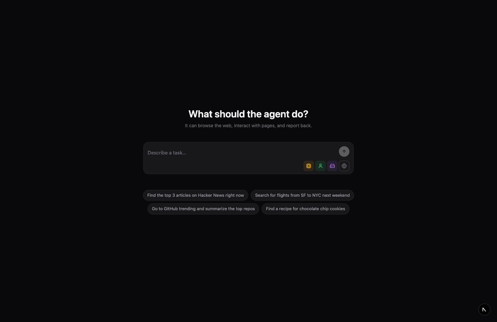
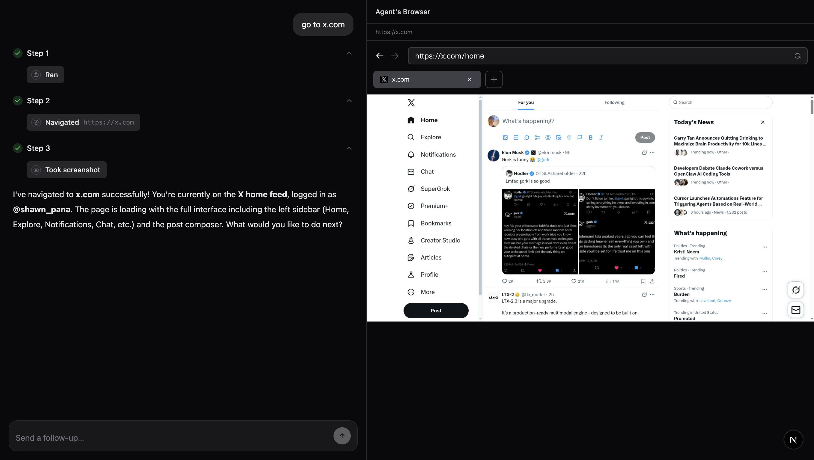

# Browser Use Chat UI Example

A chat interface for [Browser Use](https://browser-use.com) that lets you give tasks to an AI agent that can browse the web in real time. Built with Next.js 15, React 19, and the Browser Use SDK.

[](https://vercel.com/new/clone?repository-url=https%3A%2F%2Fgithub.com%2Fbrowser-use%2Fchat-ui-example&env=NEXT_PUBLIC_BROWSER_USE_API_KEY&envDescription=Your%20Browser%20Use%20API%20key&envLink=https%3A%2F%2Fcloud.browser-use.com&project-name=browser-use-chat-ui&repository-name=browser-use-chat-ui)





## Quick Start

### 1. Get a Browser Use API Key

Sign up at [browser-use.com](https://browser-use.com) and grab your API key from the dashboard.

### 2. Clone & Install

```bash
git clone https://github.com/browser-use/chat-ui-example.git
cd chat-ui-example
npm install
```

### 3. Configure Environment

```bash
cp .env.example .env.local
```

Edit `.env.local` and add your API key:

```
NEXT_PUBLIC_BROWSER_USE_API_KEY=your-api-key-here
```

### 4. Run

```bash
npm run dev
```

Open [http://localhost:3000](http://localhost:3000).

## Usage

1. Type a task like "Find the top 3 articles on Hacker News"
2. The agent browses the web and reports back in real time
3. Watch the agent work in the live browser panel (desktop only)
4. Send follow-up messages to refine or continue the task
5. When the session ends, download an MP4 recording of the browser session

### Settings

Use the icon buttons below the chat input to configure:

| Icon | Setting | Options |
|------|---------|---------|
| CPU | Model | BU Mini (fast) / BU Max (powerful) |
| User | Profile | Browser profiles with saved cookies/sessions |
| HardDrive | Workspace | Workspace context for file operations |
| Globe | Proxy | Route traffic through 190+ country proxies |

Settings are persisted in localStorage across sessions.

## How It Works — Browser Use SDK

This app is built on the [Browser Use Cloud SDK](https://docs.browser-use.com/cloud/introduction) (`browser-use-sdk`). Here's how the key pieces are wired up.

### 1. Install the SDK

```bash
npm install browser-use-sdk
```

### 2. Initialize the client

```typescript
import { BrowserUse } from "browser-use-sdk/v3";

const client = new BrowserUse({
  apiKey: process.env.NEXT_PUBLIC_BROWSER_USE_API_KEY,
});
```

### 3. Create a session

A session gives you a persistent browser that the agent controls. You pick the model and optionally attach a profile, workspace, or proxy.

```typescript
const session = await client.sessions.create({
  model: "bu-mini",    // or "bu-max" for complex tasks
  keepAlive: true,     // keep browser open between tasks
});
// session.id         → use to send follow-up tasks
// session.liveUrl    → embed in an iframe for live viewing
```

### 4. Send tasks and poll for results

Send a natural-language task to the session, then poll for status and messages:

```typescript
// Send a task
await client.sessions.create({
  sessionId: session.id,
  task: "Find the top 3 articles on Hacker News",
  keepAlive: true,
});

// Poll for messages
const { messages } = await client.sessions.messages(session.id, { limit: 100 });

// Check session status
const status = await client.sessions.get(session.id);
// status.status → "running" | "completed" | "stopped" | "error" | "timed_out"
```

### 5. Stop a task

```typescript
await client.sessions.stop(session.id, { strategy: "task" });
```

### 6. Get recording

After a session completes, you can retrieve an MP4 recording of the browser session:

```typescript
const { recordingUrls } = await client.sessions.waitForRecording(session.id);
// recordingUrls → string[] of MP4 download URLs
```

| Method | Description |
|--------|-------------|
| `client.sessions.waitForRecording()` | Get recording MP4 URLs |

In this app, all SDK calls live in [`src/lib/api.ts`](src/lib/api.ts), and polling is handled by TanStack Query in [`src/context/session-context.tsx`](src/context/session-context.tsx) with a 1-second refetch interval that automatically stops when the session reaches a terminal state.

For full SDK documentation, see [docs.browser-use.com/cloud/introduction](https://docs.browser-use.com/cloud/introduction).

## Architecture

```
src/
├── app/
│   ├── layout.tsx              # Root layout with providers
│   ├── page.tsx                # Home — create new session
│   └── session/[id]/page.tsx   # Session — chat + browser view
├── components/
│   ├── browser-panel.tsx       # Live browser iframe
│   ├── chat-input.tsx          # Auto-expanding textarea + send
│   ├── chat-messages.tsx       # Conversation turn rendering
│   ├── markdown.tsx            # GFM markdown renderer
│   ├── model-selector.tsx      # Settings icon dropdowns
│   ├── step-section.tsx        # Collapsible task steps
│   ├── thinking-indicator.tsx  # Animated thinking dots
│   └── tool-call-pill.tsx      # Tool call display pills
├── context/
│   ├── session-context.tsx     # Session polling & message state
│   └── settings-context.tsx    # User preferences (localStorage)
└── lib/
    ├── api.ts                  # Browser Use SDK wrapper
    ├── countries.ts            # Country codes for proxy selector
    ├── message-converter.ts    # API → UI message transformation
    ├── tool-labels.ts          # Tool name/icon mapping
    └── types.ts                # TypeScript type definitions
```

### Data Flow

1. User sends a task from the home page
2. App creates a session via the Browser Use API and redirects to `/session/[id]`
3. Session context polls for status and messages every second
4. Messages are converted from the API format into conversation turns (user message + agent steps + final answer)
5. The browser panel displays a live iframe of the agent's browser
6. When the session completes, polling stops and the chat input is disabled

## Scripts

| Command | Description |
|---------|-------------|
| `npm run dev` | Start dev server with Turbopack |
| `npm run build` | Production build |
| `npm start` | Start production server |
| `npm run lint` | Run ESLint |

## Tech Stack

- **[Next.js 15](https://nextjs.org/)** with Turbopack
- **[React 19](https://react.dev/)**
- **[Tailwind CSS](https://tailwindcss.com/)** for styling
- **[TanStack Query](https://tanstack.com/query)** for data fetching & polling
- **[Browser Use SDK](https://docs.browser-use.com/)** for agent API
- **[react-markdown](https://github.com/remarkjs/react-markdown)** with GFM for message rendering
- **[lucide-react](https://lucide.dev/)** for icons

## License

MIT
